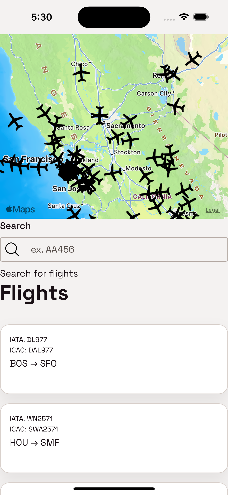
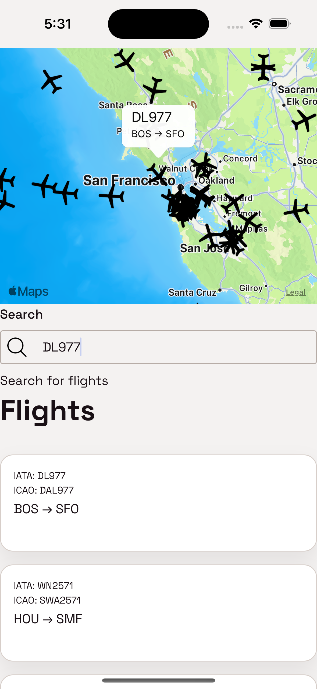

# FlightTrackingApp

FlightTrackingApp is a user-friendly mobile application designed to provide real-time flight tracking and essential travel information. Whether you're a frequent traveler or just curious about the flights in the sky, this app is your go-to companion. Stay informed about departures, arrivals, delays, and more with a sleek and intuitive user interface.

## Features

- **Real-time Flight Tracking:** Track flights worldwide in real-time, including live updates on departure and arrival times.

- **Flight Details:** Access detailed information about each flight, including aircraft type, altitude, speed, and more.

- **Search and Filter:** Easily search for specific flights, airlines, or airports. Use filters to customize your view and focus on what matters to you.

- **Interactive Map:** Visualize flights on an interactive map with smooth navigation and zoom features.

## Screenshots

*The clean and intuitive home screen provides an overview of your tracked flights.*

*Detailed flight information, including current altitude, speed, and route.*

## Installation

FlightTrackingApp is available for both iOS and Android devices. Simply download it from the App Store or Google Play Store to get started.

### iOS

1. Open the App Store on your iOS device.
2. Search for "FlightTrackingApp."
3. Tap "Install" to download and install the app.

### Android

1. Open the Google Play Store on your Android device.
2. Search for "FlightTrackingApp."
3. Tap "Install" to download and install the app.

## Getting Started

1. Open FlightTrackingApp on your mobile device.
2. Explore the home screen to view tracked flights or use the search feature to find specific flights, airlines, or airports.
3. Customize your settings, add favorite flights, and enjoy staying informed about the world of aviation.

## Feedback and Support

We value your feedback! If you encounter any issues or have suggestions for improvement, please contact our support team at [frankroberto2000@gmail.com](mailto:frankroberto2000@gmail.com).

Happy tracking! ✈️